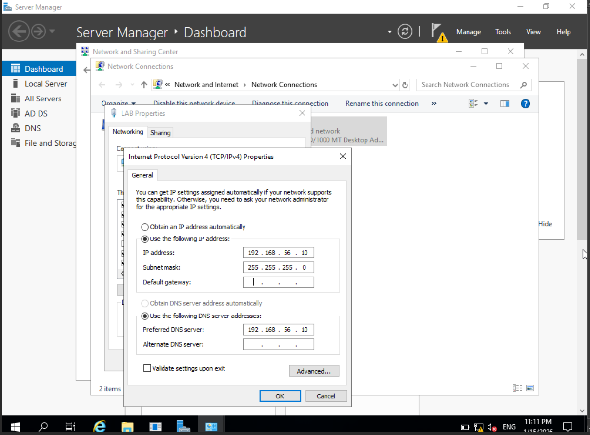
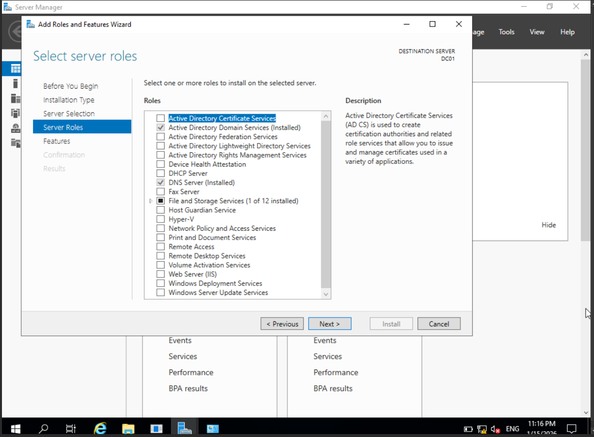

# AD Home Lab - Step-by-Step (AD DS + DNS)

This document describes how the lab was built and verified.

## Lab Components
- Hypervisor: VirtualBox
- VMs:
  - Windows Server (Domain Controller)
  - Windows 10 (Client)
- Network:
  - Adapter 1: NAT (Internet)
  - Adapter 2: Internal Network (LAB)

---

## 1) VirtualBox Network Configuration
**Windows Server VM**
- Adapter 1: NAT
- Adapter 2: Internal Network (LAB)

**Windows 10 VM**
- Adapter 1: NAT
- Adapter 2: Internal Network (LAB)

Screenshot:

---

## 2) Configure Domain Controller (Windows Server)

### 2.1 Set Static IP + DNS
On the Domain Controller:
- Set a **static IP**
- Set **DNS = the DC IP itself**
- (Optional) Set preferred DNS only (avoid public DNS in the lab)

Example IP plan:
- DC: `192.168.56.10/24`
- DNS: `192.168.56.10`

Screenshot:

---

## 3) Install AD DS + DNS Roles
On Windows Server:
1. Open **Server Manager**
2. **Add roles and features**
3. Select:
   - **Active Directory Domain Services (AD DS)**
   - **DNS Server**
4. Install and wait until it finishes

Screenshot:

---

## 4) Promote Server to Domain Controller (Create Domain)
1. In Server Manager, click the notification flag
2. Click **Promote this server to a domain controller**
3. Choose:
   - **Add a new forest**
   - Domain name: `lab.local` (example)
4. Set DSRM password
5. Continue (defaults are fine for a lab)
6. Restart after promotion completes

Screenshot:
**Screenshot: Deployment Configuration**

**Screenshot: Domain Controller Options**

**Screenshot: Prerequisites Check**

---

## 5) Configure Windows 10 Client + Join Domain

### 5.1 Set Client DNS
On Windows 10:
- Set **DNS = DC IP**
- This is required for domain join

Example:
- Win10: `192.168.56.20/24`
- DNS: `192.168.56.10`

Screenshot:

### 5.2 Join Domain
1. Open **System** → **Rename this PC (advanced)** or **Domain/Workgroup**
2. Click **Change**
3. Select **Domain**
4. Enter domain: `lab.local`
5. Provide domain admin credentials
6. Restart

Screenshot:

---

## 6) Create OUs, Users, and Groups
On the Domain Controller:
1. Open **Active Directory Users and Computers**
2. Create OUs (example):
   - `OU=Users`
   - `OU=Computers`
   - `OU=IT`
3. Create test users (example):
   - `user01`, `user02`
4. Create groups (example):
   - `IT-Admins`
   - `Helpdesk`
5. Add users to groups as needed

Screenshot:

---

## 7) Apply a Basic Group Policy (GPO)
Example GPOs for a beginner lab:
- Disable Control Panel
- Password / lockout policy (optional)
- Basic desktop restriction (optional)

Steps:
1. Open **Group Policy Management**
2. Create a new GPO linked to the target OU
3. Configure the policy
4. Run `gpupdate /force` on the client (or restart)

Screenshot:

---

## 8) Verification & Testing
On Windows 10 client:
- Verify network and DNS:
  - `ipconfig /all`
  - `ping <DC-IP>`
  - `nslookup lab.local`
- Test domain login:
  - Log in using a domain user
- Check GPO applied:
  - `gpresult /r`

Screenshot:

